# 项目部署文档 (Docker)

> [!IMPORTANT]
> 由于服务器操作系统较旧 (Glibc 版本过低)，无法直接运行 Node.js 20。
> **我们已切换为 Docker 容器化部署方案**。这可以完美避开系统环境不兼容的问题。

> [!NOTE]
> 当前 `web/Dockerfile` **不会在容器里执行 `next build`**，而是直接复制已生成的 `.next` 构建产物。
> 因此若选择“上传代码到服务器再 `docker compose up --build`”，请确保上传内容里包含已构建好的 `.next`（建议在本地先 `npm run build`）。

## 1. 前置要求

确保服务器已安装 Docker。
由于 Docker 版本较新 (24+)，我们将使用内置的 **Docker Compose V2** 插件。

```bash
# 检查是否安装
docker compose version
# 如果报错 'docker: 'compose' is not a docker command'，则尝试旧版命令：
# docker-compose version
```

## 2. 部署步骤

1.  **准备构建产物并上传**:
    - 推荐：在本地执行 `npm run build:prod` 后，将生成的 `.next-prod` 目录重命名为 `.next` 并上传（或者直接使用生成的 `dev-portal.tar`，见下文）。
    - 理由：`build:prod` 专为生产环境构建，且不会覆盖您本地开发用的 `.next` 目录。
    - 或者：使用下方第 6 节“本地构建并上传 (离线部署)”直接上传镜像包（更稳定，最推荐）。

2.  **构建并启动**:
    进入目录并运行：

    ```bash
    cd web
    # 方式 1: 如果文件名是 docker-compose.yml (标准)
    docker compose up -d

    # 方式 2: 如果文件名是 docker-compose.prod.yml (未重命名)
    docker compose -f docker-compose.prod.yml up -d
    ```

    _(如果是第一次运行，构建过程可能需要几分钟)_

3.  **验证**:
    ```bash
    docker compose ps
    ```
    状态应为 `Up`。访问 `http://服务器IP:3001` 即可。

## 3. 常用命令

- **查看日志**:
  ```bash
  docker compose logs -f
  ```
- **重启服务**:
  ```bash
  docker compose restart
  ```
- **停止服务**:
  ```bash
  docker compose down
  ```
- **更新代码后重新部署**:
  ```bash
  # 拉取/更新代码后
  docker compose up -d --build
  ```

## 3.1 Prisma 数据库迁移（强烈建议保留）

> [!IMPORTANT]
> `npx prisma generate` **只会生成 Prisma Client（类型/代码）**，不会建表/加字段/删字段。
> 真正让数据库结构“从 0 变成可用”，需要跑迁移（migrations）。

### 开发环境（本地）

当你修改了 `prisma/schema.prisma`（例如新增字段）：

```bash
# 生成并应用迁移（会连接数据库）
npx prisma migrate dev

# 如果遇到 Prisma Client 字段不一致（例如提示 Unknown argument），可手动再生成一次
npx prisma generate
```

> [!NOTE]
> 如果你本地正在跑 `npm run dev`，改完 schema 后仍然报 “Unknown argument xxx”，通常是旧 Prisma Client/旧 dev 进程未刷新：
> 先停掉 `npm run dev` 再重新启动即可。

### 生产/服务器（Docker）

部署时（无论数据库是空库还是已有数据），建议用 **deploy** 模式执行迁移：

```bash
# 只会应用 prisma/migrations 中尚未执行的迁移（不会生成新迁移）
npx prisma migrate deploy

# 确保 Prisma Client 与 schema 一致
npx prisma generate
```

> [!TIP]
> 如果你们确定“每次都是全新空库”，理论上可以用 `npx prisma db push` 直接同步结构；
> 但它没有迁移历史、不利于排查与回溯，所以本项目选择保留 migrations。

## 4. (可选) 清理无效的 NVM 环境

由于我们已切换到 Docker 部署，宿主机上之前安装的 NVM 和 Node (因 Glibc 版本过低无法使用) 可以安全清理。

**清理步骤**:

1.  **删除 NVM 目录**:

    ```bash
    rm -rf ~/.nvm
    ```

2.  **清理 Shell 配置**:
    编辑 `~/.bashrc` (或 `~/.zshrc`)，删除以下 NVM 初始化代码：

    ```bash
    export NVM_DIR="$HOME/.nvm"
    [ -s "$NVM_DIR/nvm.sh" ] && \. "$NVM_DIR/nvm.sh"
    ```

3.  **生效**:
    ```bash
    source ~/.bashrc
    ```

## 5. (故障排除) Docker 镜像拉取超时

如果构建时卡在 `load metadata for docker.io/library/node:20-alpine`，说明服务器无法连接 Docker Hub。
请配置国内镜像加速器。

**操作步骤**:

1.  **编辑配置**:

    ```bash
    mkdir -p /etc/docker
    vim /etc/docker/daemon.json
    ```

2.  **写入以下内容** (使用国内可用源):

    ```json
    {
      "registry-mirrors": [
        "https://docker.m.daocloud.io",
        "https://huecker.io",
        "https://dockerhub.timeweb.cloud",
        "https://noohub.ru"
      ]
    }
    ```

3.  **重启 Docker**:

    ```bash
    systemctl daemon-reload
    systemctl restart docker
    ```

## 6. (替代方案) 本地构建并上传 (离线部署)

如果服务器网络实在太差，您可以在 **本地电脑** 构建好镜像，然后上传到服务器。
_(注意：需要本地也安装 Docker)_

### 方式 A: 使用 NPM 快捷命令 (推荐)

我们在 `package.json` 中配置了快捷脚本，您只需运行：

1.  **一键构建并打包**:

    ```bash
    npm run docker:pack
    # 该命令会自动运行 npm run build:prod 并打包成 dev-portal.tar
    # 且不会影响您本地正在运行的开发环境 (.next)
    ```

2.  **上传文件**:
    您需要上传可以通过离线部署的 **两个核心文件**：
    - `dev-portal.tar` (镜像包)
    - `docker-compose.prod.yml` (**生产环境专用配置**，请在服务器上重命名为 `docker-compose.yml`)

    ```bash
    scp dev-portal.tar root@your-server-ip:/root/project/
    scp docker-compose.prod.yml root@your-server-ip:/root/project/docker-compose.yml
    ```

### 方式 B: 手动执行命令

1.  **本地构建 (指定 x86 架构)**:

    > [!IMPORTANT] > **Mac M1/M2/M3 (Apple Silicon) 用户必须保留 `--platform linux/amd64` 参数**。
    > 否则构建出的镜像（ARM 架构）将无法在普通 Linux 服务器（通常是 x86/AMD64 架构）上运行。

    ```bash
    # 在项目根目录执行
    docker buildx build --platform linux/amd64 -t dev-portal:latest .
    ```

2.  **导出镜像**:

    ```bash
    docker save -o dev-portal.tar dev-portal:latest
    ```

3.  **上传到服务器**:

    ```bash
    # 使用 scp 或其他工具
    scp dev-portal.tar root@your-server-ip:/root/
    ```

4.  **服务器导入**:

    ```bash
    docker load -i dev-portal.tar
    ```

5.  **修改配置启动**:
    编辑服务器上的 `docker-compose.yml`，注释掉 `build` 部分，直接使用镜像：
    ```yaml
    version: "3"
    services:
      dev-portal:
        image: dev-portal:latest # <--- 使用导入的镜像
        # build:                  # <--- 注释掉构建配置
        #   context: .            # <--- 注释掉
        #   dockerfile: Dockerfile # <--- 注释掉
        container_name: dev-portal
        restart: always
        ports:
          - "3001:3001"
        environment:
          - NODE_ENV=production
    ```
    然后运行 `docker compose up -d` 即可。

### 🚀 极简运维 (推荐)

我们为您准备了 `server-deploy.sh` 脚本，将它与 `dev-portal.tar` 一起上传到服务器，然后执行：

```bash
chmod +x server-deploy.sh
./server-deploy.sh
```

会出现交互式中文菜单，您可以选择：

1. **首次部署（初始化）**：自动检查 `.env`、加载 `dev-portal.tar` 并启动服务。
2. **更新应用（加载 tar 并重建）**：上传新的 `dev-portal.tar` 后使用；更新前会询问是否需要备份（默认不备份）。
3. **仅重启服务**：不更新镜像，仅重启容器。
4. **查看日志（Ctrl+C 返回）**：进入 `docker compose logs -f` 跟随日志，按 `Ctrl+C` 返回菜单。
5. **进入容器 Shell（exit 返回）**：进入容器后输入 `exit` 返回菜单。
6. **清理未使用镜像**：执行 `docker image prune -f`。
7. **备份当前版本（镜像 + 配置 + tar）**：备份到 `./backups/<时间戳>/`。
8. **回滚到备份版本**：从 `./backups/` 选择一个备份回滚（可选同时恢复 `.env/compose`）。

每次执行完一项操作后，脚本会询问是否继续；默认不继续并自动退出。

#### 备份与空间占用说明

- 备份目录：`./backups/YYYYMMDD-HHMMSS/`
- 环境检查：脚本会检查 `.env` 中的 `DEVPORTAL_EXTENSION_API_KEY`，未配置会提示输入（否则插件可能提示 `Server not configured`）。
- 备份内容（尽力而为，缺少就跳过）：
  - `dev-portal.tar`（如果当前目录存在，会复制一份进去）
  - `image.tar`（如果服务器上存在 `dev-portal:latest` 镜像，会 `docker save` 备份一份）
  - `.env` 与 `docker-compose*.yml`
- 空间占用：`dev-portal.tar` 与 `image.tar` 体积通常同量级（都可能比较大），因此默认只保留最近 1 份备份。
- 保留策略：脚本内置 `BACKUP_KEEP=1`，每次备份后会自动清理旧备份（只会清理 `./backups/` 下符合时间戳格式的目录，不会影响容器、数据库或其他文件）。

### 🔄 服务器端如何更新 (重启)?

当您上传了新的 `dev-portal.tar` 到服务器后，请按以下步骤更新服务：

1.  **导入新镜像**:
    ```bash
    docker load -i dev-portal.tar
    ```
2.  **重启服务 (加载新镜像)**:

    ```bash
    # 停止并删除旧容器
    docker compose down

    # 启动新容器
    docker compose up -d
    ```

    _(注：必须执行 down 再 up，或者使用 `docker compose up -d --force-recreate`，否则 Docker 可能会认为容器没变而不更新)_

## 7. (附录) 技术原理：为什么这样快且稳？

为了解决 Mac Apple Silicon (ARM) 模拟 Linux (x86) 构建慢且易崩溃的问题，我们采用了 **“本地构建 + 注入 (Native Injection)”** 策略。

### 核心流程可视化

```mermaid
graph TD
    %% Define Styles
    classDef local fill:#e6f7ff,stroke:#1890ff,stroke-width:2px;
    classDef server fill:#f6ffed,stroke:#52c41a,stroke-width:2px;
    classDef artifact fill:#fff7e6,stroke:#fa8c16,stroke-width:2px,stroke-dasharray: 5 5;

    subgraph Local ["💻 本地环境 (Mac M-Chip)"]
        direction TB
        Code[Source Code] --> |1. npm run build:prod| NextDist[.next-prod 文件夹]:::artifact
        NextDist --> |2. COPY| DockerBuild["Docker Build (x86)"]
        Pkg[package.json] --> |3. npm ci --prod| DockerBuild
        DockerBuild --> |4. docker save| TarFile[dev-portal.tar]:::artifact
    end

    TarFile --> |5. scp 上传| ServerEnv
    Config[docker-compose.prod.yml] --> |5. scp 上传| ServerEnv

    subgraph ServerEnv ["☁️ 生产服务器 (Linux)"]
        direction TB
        LoadedImage[Loaded Image]
        RunningContainer[🟢 Running Container]

        TarFile --> |6. docker load| LoadedImage
        Config --> |7. docker compose up| RunningContainer
        LoadedImage -.-> RunningContainer
    end

    class Local local
    class ServerEnv server
```



### 构建流程图解

1.  **本地编译 (Local Build)**:
    - 在您的 Mac 上利用原生 CPU 性能执行 `npm run build:prod`。
    - **产出**: `.next-prod` 文件夹（包含通用的 JS/CSS/HTML 产物）。
    - **隔离**: 此过程**不影响**您本地 `.next` 目录（即不影响 `npm run dev`）。
    - _注意：此时本地的 `node_modules` 是 Mac 版的，不会被打包。_

2.  **Docker 依赖安装 (Container Install)**:
    - Docker 构建时，会自动忽略本地的 `node_modules`。
    - 在容器内部（Linux x86 环境）执行 `npm ci --only=production`。
    - **产出**: 纯正的 Linux 版 `node_modules`（完美支持 Sharp, Prisma 等原生库）。

3.  **产物注入 (Injection)**:
    - 最后将第 1 步生成的 `.next-prod` 文件夹复制进容器（自动重命名为 `.next`）。
    - 结果：获得了一个既包含最新代码，又拥有正确底层依赖的完美镜像。

## 8. 公司内网部署与分发指南

如果您需要在公司内部推广使用本系统，请参考以下流程：

### 8.1 服务端部署 (后端)

请按照本文档第 2 节或第 6 节的步骤，将服务部署在公司内网服务器上（例如 `192.168.x.x`）。
假设部署后的服务地址为：`http://192.168.1.100:3001`

### 8.2 Chrome 扩展打包与分发 (客户端)

为了让同事们无需安装 Git 或 Node.js 环境也能使用扩展，您需要打包并分发配置好的扩展程序。

#### 第一步：修改 API 地址

打开代码中的 `chrome-extension/popup.js` 文件，将顶部的 `API_URL` 修改为内网服务器地址：

```javascript
// chrome-extension/popup.js
// const API_URL = "http://localhost:3000/api/match-credentials";
const API_URL = "http://192.168.1.100:3001/api/match-credentials"; // <--- 修改这里
const API_KEY = "YOUR_SHARED_KEY"; // <--- 同时配置 Key（与服务端 DEVPORTAL_EXTENSION_API_KEY 一致）
```

#### 第二步：打包扩展

1.  进入 `chrome-extension` 目录。
2.  将该目录下的所有文件（`manifest.json`, `popup.html`, `popup.js`, `background.js`, `README.md` 等）打包成一个 `.zip` 压缩包。
3.  命名建议：`DevPortal-Extension-v1.0.zip`。

#### 第三步：分发与安装

1.  将 `DevPortal-Extension-v1.0.zip` 发送给同事，或上传到公司网盘。
2.  **同事需执行的操作**：
    - 解压 `.zip` 包到一个固定文件夹。
    - 打开 Chrome 浏览器，访问 `chrome://extensions/`。
    - 开启右上角的 **“开发者模式”**。
    - 点击左上角的 **“加载已解压的扩展程序”**，选择解压后的文件夹。
    - 推荐点击浏览器工具栏的“拼图”图标，将插件 **固定 (Pin)** 在工具栏上。

---

Powered by Next.js & Prisma
