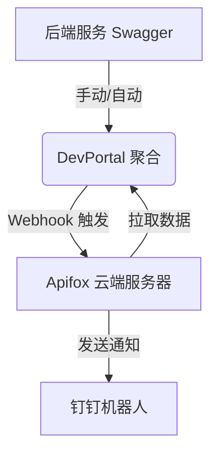

# Swagger 聚合与 Apifox 自动同步使用手册

本手册旨在指导开发者如何利用 DevPortal 的 Swagger 工具实现多服务接口聚合，并将其全自动同步至 Apifox 环境。

---

## 1. 核心流程图

---

## 2. 环境配置清单 (.env)

在服务器部署前，请确保服务器端的 `.env` 文件中包含以下核心变量：

| 变量名                   | 必填 | 描述                                                                                          |
| :----------------------- | :--- | :-------------------------------------------------------------------------------------------- |
| `PUBLIC_URL`             | 是   | **公网拉取地址**：Apifox 云端拉取接口数据时访问的地址（需公网通）。                           |
| `INTERNAL_WEBHOOK_URL`   | 否   | **内网回调地址**：用于 Jenkins 回调。建议配置为内网固定 IP，如 `http://192.168.60.201:3001`。 |
| `SWAGGER_EXPORT_SECRET`  | 是   | 导出接口的安全验证密钥，建议设置为复杂的随机字符串。                                          |
| `APIFOX_ACCESS_TOKEN`    | 是   | Apifox 个人访问令牌（在 Apifox 账号设置中获取）。                                             |
| `JENKINS_WEBHOOK_SECRET` | 是   | 与 Jenkins 约定的认证 Token (x-jenkins-token)。                                               |
| `DINGTALK_WEBHOOK_URL`   | 是   | 钉钉机器人的 Webhook 地址。                                                                   |

---

## 3. 手动操作指南

1.  **快速填单**：打开 `DevPortal > 工具箱 > Swagger 聚合`。
2.  **智能粘贴**：复制后端服务的任意 Swagger 地址（如 `http://test-api.com/doc.html`），粘贴到 **Target URL**，系统自动拆分域名和前缀。
3.  **验证连接**：点击“**测试连接**”，确保 DevPortal 能解析该服务的 Swagger。
4.  **Apifox 预览**：在“聚合导入链接”区域查看生成的 URL，可直接点击“浏览器访问”检查数据流。

---

## 4. 自动化同步 (Jenkins 接入)

1.  **准备参数**：在 Webhook 配置区填入 Apifox 的 **Project ID** 和 **项目名称**。
2.  **获取脚本**：系统自动生成 **Groovy** (用于 Pipeline) 或 **cURL** (用于 Shell)。
3.  **Jenkins 配置**：将脚本拷贝到 Jenkins 任务的构建后操作中。
4.  **效果**：构建成功后自动触发 Apifox 同步，同步完成后，钉钉会收到包含“接口统计”和“模型统计”的推送。

---

## 5. 同步日志与排查 (New)

### 5.1 钉钉通知增强

同步完成后，钉钉通知将清晰地分行展示：

- **策略**: 智能合并 (Smart Merge)
- **说明**: 解释可能产生的数据变更原因
- **推送时间**: 精确到秒的操作时间

### 5.2 可视化日志查询

若需要排查同步异常（如字段未生效），可前往系统后台：

1. 进入 **[系统配置] -> [同步日志]** 菜单。
2. 查看每一次同步的详细状态与统计。
3. 点击 **[详情]** 按钮，查看 Apifox 返回的 **完整原始 JSON 报文**，快速定位问题根源。

---

## 6. 常见问题排查 (Troubleshooting)

### Q1: Apifox 报错 422001 (Invalid Parameter)

- **原因**：Apifox 云端无法连接到你配置的 `PUBLIC_URL`，或 `SWAGGER_EXPORT_SECRET` 校验失败。
- **对策**：确保 `PUBLIC_URL` 是真实公网地址（非 localhost），且 Token 正确。

### Q2: 复制按钮报错 'writeText'...

- **原因**：浏览器限制非 HTTPS 域名调取剪贴板。
- **对策**：代码已内置兜底方案。如果失效，请手动复制或升级系统到 HTTPS。

### Q3: 钉钉通知信息不全

- 确保服务器已部署最新版代码。目前已支持合并展示接口计数和 Schema 模型计数。

---

> [!TIP]
> **推荐方案**：Jenkins 脚本使用 `INTERNAL_WEBHOOK_URL` (内网 IP) 保证推送稳定；`.env` 正确配置 `PUBLIC_URL` (公网域名) 保证 Apifox 抓取成功。
